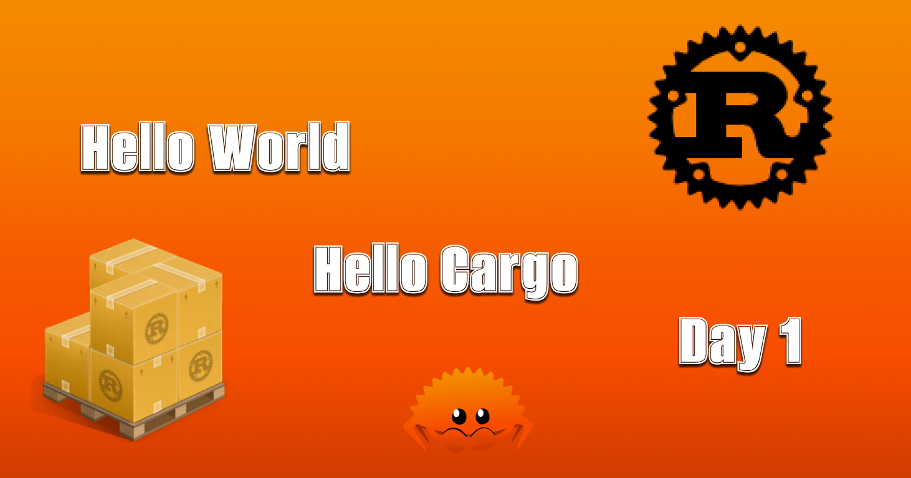

_Contained within this repository are the very resources that guided me from being a complete beginner in Rust to attaining a level of mastery in the language._

---
> Online book: https://doc.rust-lang.org/book/title-page.html

## Links: 
|#| Image | Topic | Twitter Post |
|---| ------------------- | ---------------- | ------- | 
|1||[Introduction](https://doc.rust-lang.org/book/title-page.html)| [Day1](https://twitter.com/edsondsouza/status/1685876534375231489?s=20)|

